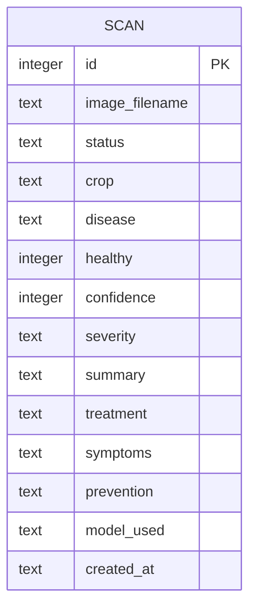

# Database Design

## 1. Overview

BID CROP records every diagnosis it performs so that users can review a history
of past scans and view simple statistics (total scans, diseased vs. healthy
leaves, and the most frequently detected disease). This persistence is provided
by a small relational database.

The database is deliberately lightweight: the application's core function is a
single request–response flow (upload a leaf photo → receive an AI diagnosis),
so the data model only needs to capture the outcome of each scan. A single
well-defined table is therefore sufficient.

## 2. Choice of database management system (DBMS)

**SQLite** was chosen for the implementation, for the following reasons:

| Requirement | How SQLite meets it |
|---|---|
| Zero configuration | Serverless — the entire database is one file (`scans.db`); nothing to install or administer. |
| Portability | The database file travels with the project, making it easy to demonstrate and back up. |
| Standard library support | Accessed through Python's built-in `sqlite3` module, so no extra dependency is added to the project. |
| Sufficient scale | The workload is low-volume (one row per scan); SQLite comfortably handles this. |
| SQL compliance | Uses standard SQL, so the same schema can be migrated to a client–server DBMS later. |

For a production deployment serving many concurrent users, the same schema could
be migrated to a client–server DBMS such as **PostgreSQL** with only minor
changes (data types and the connection layer). The logical design below is
independent of the engine used.

## 3. Conceptual design (entity–relationship model)

The system has one core entity: **Scan** — a single diagnosis performed on an
uploaded leaf image.



Because the current system does not implement user accounts, every scan is an
independent record and there are no inter-entity relationships. The design can
be extended in future (see Section 7) to introduce a **User** entity, giving a
one-to-many relationship: *one user performs many scans*.

## 4. Logical design (relational schema)

**Relation:** `scans (id, image_filename, status, crop, disease, healthy,
confidence, severity, summary, treatment, symptoms, prevention, model_used,
created_at)`

- **Primary key:** `id`
- **Functional dependency:** `id → (all other attributes)`

The relation is in **Third Normal Form (3NF)**: `id` is the sole candidate key,
every non-key attribute depends on the whole key, and there are no transitive
dependencies between non-key attributes (each attribute describes an
independent property of the same scan event).

## 5. Data dictionary

| Attribute | Data type | Constraints | Description |
|---|---|---|---|
| `id` | INTEGER | PRIMARY KEY, AUTOINCREMENT | Unique identifier for each scan. |
| `image_filename` | TEXT | NOT NULL | Name of the uploaded image file, stored in `static/shots/`. |
| `status` | TEXT | NOT NULL | Outcome of the scan: `ok` (a diagnosis) or `not_leaf` (image rejected as not a leaf). |
| `crop` | TEXT | NULL allowed | Identified crop/plant (e.g. "Tomato", "Maize"). |
| `disease` | TEXT | NULL allowed | Identified disease, or "Healthy". |
| `healthy` | INTEGER | 0 or 1 | Boolean flag: 1 if the leaf is healthy, 0 otherwise. |
| `confidence` | INTEGER | 0–100 | Model's confidence in the identification, as a percentage. |
| `severity` | TEXT | NULL allowed | Disease severity: "None", "Mild", "Moderate" or "Severe". |
| `summary` | TEXT | NULL allowed | Plain-language summary of the result. |
| `treatment` | TEXT | NULL allowed | Recommended treatment / management action. |
| `symptoms` | TEXT | NULL allowed | Description of the visible symptoms. |
| `prevention` | TEXT | NULL allowed | Prevention advice. |
| `model_used` | TEXT | NULL allowed | The AI model that produced the result (e.g. `qwen2.5vl:7b-cloud`). |
| `created_at` | TEXT | NOT NULL | Timestamp of the scan (`YYYY-MM-DD HH:MM:SS`). |

> **Note on booleans and dates:** SQLite has no dedicated BOOLEAN or DATETIME
> type, so `healthy` is stored as an integer (0/1) and `created_at` as an ISO-8601
> text string. This is standard practice for SQLite.

## 6. Physical design (SQL definition)

The table is created automatically on application start-up by `init_db()` in
[`db.py`](../db.py):

```sql
CREATE TABLE IF NOT EXISTS scans (
    id             INTEGER PRIMARY KEY AUTOINCREMENT,
    image_filename TEXT    NOT NULL,
    status         TEXT    NOT NULL,   -- ok / not_leaf
    crop           TEXT,
    disease        TEXT,
    healthy        INTEGER,            -- 0 / 1
    confidence     INTEGER,            -- 0-100
    severity       TEXT,
    summary        TEXT,
    treatment      TEXT,
    symptoms       TEXT,
    prevention     TEXT,
    model_used     TEXT,
    created_at     TEXT    NOT NULL
);
```

## 7. Data flow and lifecycle

1. **Create** — When a user uploads an image and the AI returns a result, the
   `/upload` route calls `db.save_scan()`, inserting one new row. Only genuine
   outcomes (`ok` and `not_leaf`) are stored; transient failures (network errors
   or an unconfigured API key) are not persisted.
2. **Read** — The `/history` route calls `db.get_all_scans()` (most recent first)
   and `db.get_stats()` to render the history page and its summary figures.
3. **Retain** — Records are kept indefinitely. The associated image files live
   in `static/shots/`, referenced by `image_filename`.

The database file (`scans.db`) is excluded from version control so that
generated data and uploaded images are not committed to the repository.

## 8. Possible extensions (future work)

- **User accounts** — Introduce a `users` table and a `user_id` foreign key on
  `scans`, giving a one-to-many relationship (one user → many scans) so each
  person sees only their own history.
- **Reference tables** — Normalise `crop` and `disease` into lookup tables if a
  controlled vocabulary or per-disease reference information is required.
- **Migration to PostgreSQL** — For multi-user production use, migrate the same
  schema to PostgreSQL for better concurrency and remote hosting.
